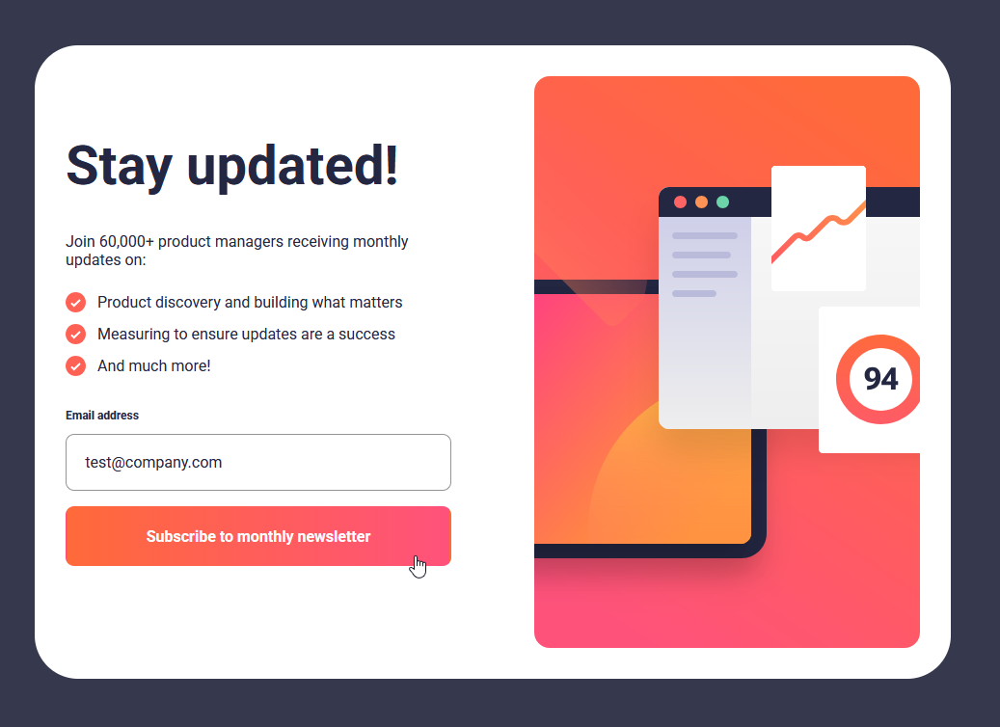
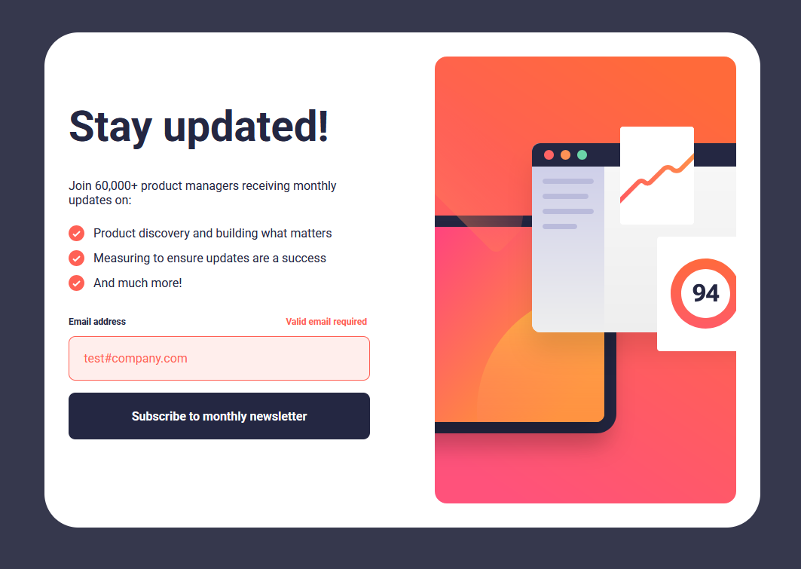
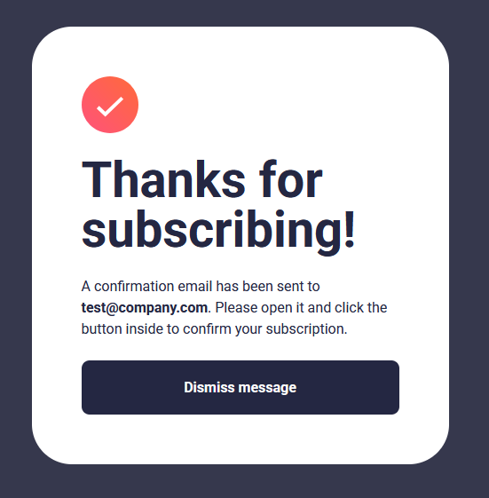
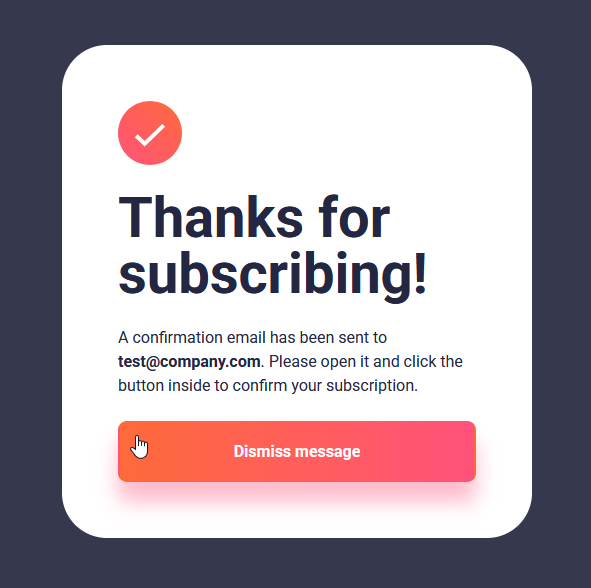
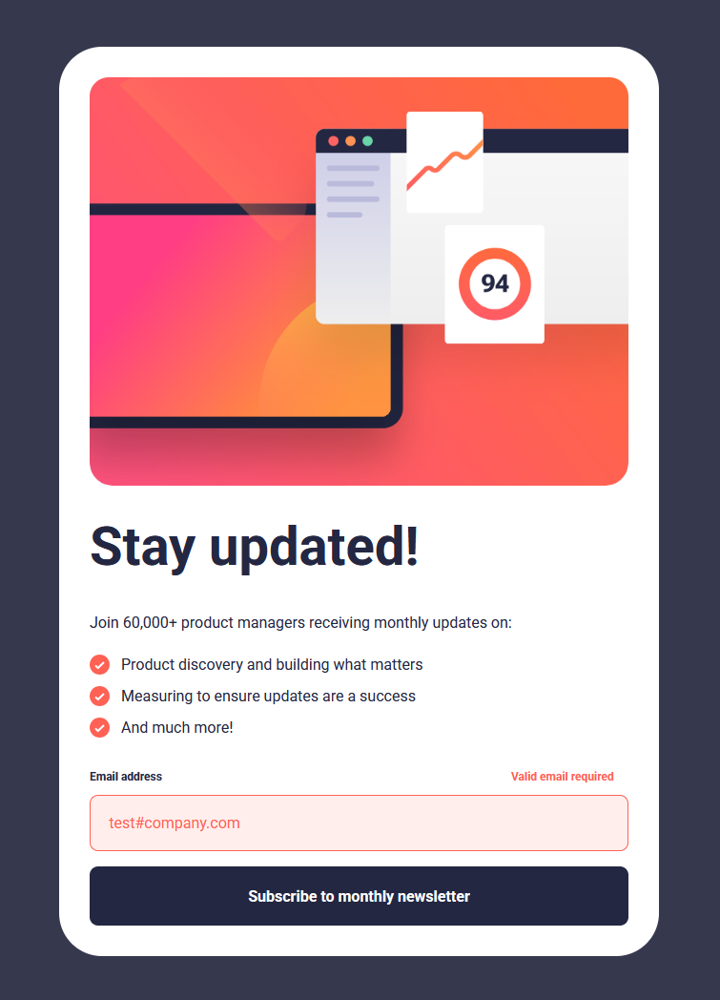
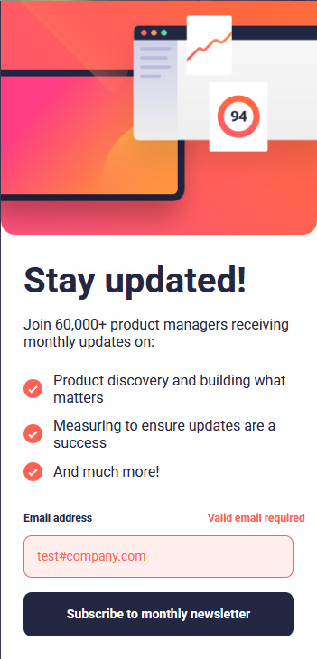
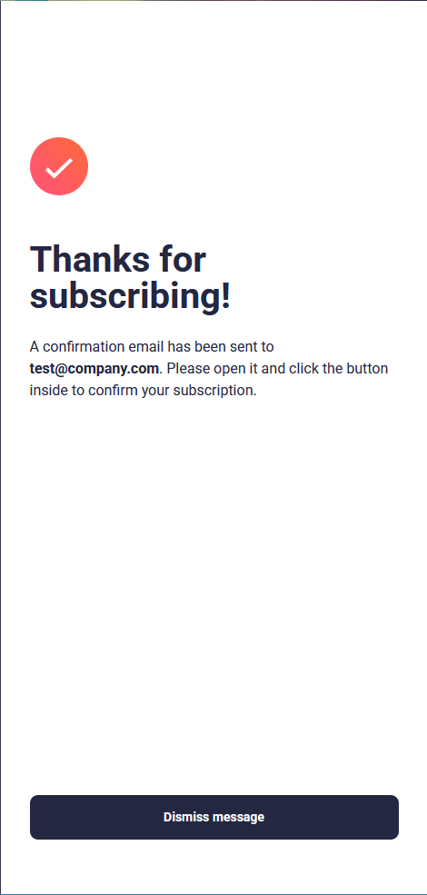

# Frontend Mentor - Newsletter sign-up form with success message solution

This is a solution to the [Newsletter sign-up form with success message challenge on Frontend Mentor](https://www.frontendmentor.io/challenges/newsletter-signup-form-with-success-message-3FC1AZbNrv).

## Table of contents

- [Overview](#overview)
  - [The challenge](#the-challenge)
  - [Screenshot](#screenshot)
  - [Links](#links)
- [My process](#my-process)
  - [Built with](#built-with)
  - [What I learned](#what-i-learned)
  - [Useful resources](#useful-resources)
- [Author](#author)

## Overview

### The challenge

Users should be able to:

- Add their email and submit the form
- See a success message with their email after successfully submitting the form
- See form validation messages if:
  - The field is left empty
  - The email address is not formatted correctly
- View the optimal layout for the interface depending on their device's screen size
- See hover and focus states for all interactive elements on the page

### Screenshot


#### Main Page

##### Desktop

Main Page:


Active State:



Error State:



Main Page - Success:




##### Tablet

Main Page:


Error State:



Main Page - Success:


##### Mobile

Main Page:


Error State:



Main Page - Success:



### Links

- Solution URL: [https://github.com/bsd-rgb/Newsletter-SignUp](https://github.com/bsd-rgb/Newsletter-SignUp)
- Live Site URL: [https://bsd-rgb.github.io/Newsletter-SignUp/](https://bsd-rgb.github.io/Newsletter-SignUp/)

## My process

### Built with

- HTML
- CSS
  - Flexbox
- JavaScript

### What I learned

One handy thing that I learned was to use the `content` property to change the image source, based on my media query breakpoint.

```css
.cta__img {
  content: url(./assets/images/illustration-sign-up-mobile.svg);
}
```

### Useful resources

- [Setting custom error messages on html forms](https://www.youtube.com/watch?v=h5qqmE83Tes&list=PLh1lGQ1BeT03TZC3j8xtGyc721ItL7PhY&index=2) - This video helped me set a custom error message and strengthened my understanding of form validation. Kevin is a great teacher for everything CSS, in my opinion.

## Author

- Frontend Mentor - [@bsd-rgb](https://www.frontendmentor.io/profile/bsd-rgb)
